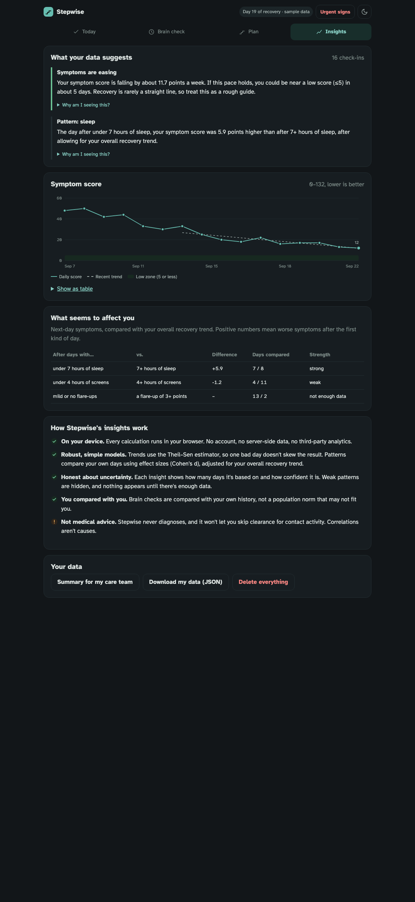
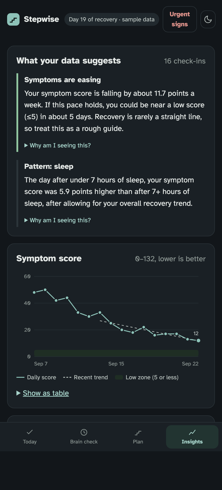
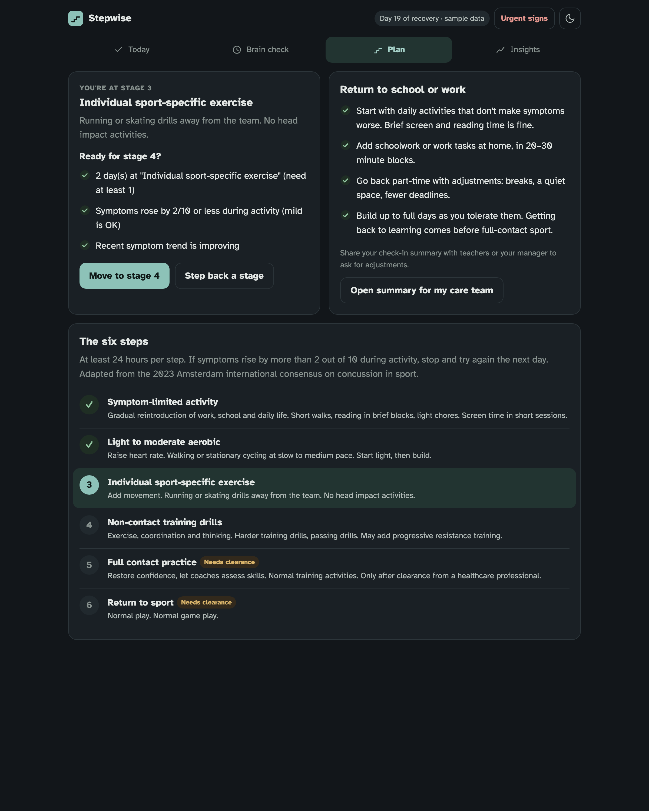

# Stepwise

**A calm, private companion for concussion recovery.**

After a concussion, people are often told to "rest, then ease back in", and then left on their own to figure out what that means. Stepwise turns the international consensus guidance into something you can follow day to day. It tracks symptoms with the same 22-item scale clinicians use, checks thinking speed and memory against your own baseline, walks you through the 6-step return-to-activity plan, and explains what your data suggests, with the evidence behind each insight.

It's built for a sore head: a dark and **dim** mode for light sensitivity, no animation, large tap targets, a hyperlegible typeface, and a screen-break reminder every 20 minutes.

[](https://render.com/deploy?repo=https://github.com/allengitworld20/stepwise)

**Live app: https://stepwise-ye4l.onrender.com** · [Open with sample data](https://stepwise-ye4l.onrender.com/?demo)

> Hosted on Render's free tier, so the first visit after a quiet spell can take up to a minute to wake up.

<p align="center">
  
  
</p>
<p align="center"></p>

## Features

| | |
|---|---|
| **Daily check-in** | 22 symptoms rated 0–6 (the SCAT symptom scale), plus sleep, screen time and how much symptoms rose during activity. Takes about two minutes. |
| **Brain checks** | A 5-tap reaction-time test (median, with false-start detection) and a digit-span memory game. Results are compared with *your own* history, not population norms. |
| **Return-to-activity plan** | The 6-step graduated strategy from the 2023 Amsterdam consensus. A readiness check enforces ≥24h per step, ≤2/10 symptom rise, no worsening trend, and **requires clinician clearance before contact**. |
| **Explainable insights** | Robust symptom trend and projection, detected triggers (sleep, screens, over-exertion), and brain-check anomalies. Every insight has a "Why am I seeing this?" panel. |
| **Care-team summary** | A printable, one-page log to share with a doctor, school or employer. |
| **Safety first** | An "Urgent signs" button is always visible, listing red flags that need emergency care. |
| **Private by design** | No account, no backend database, no analytics. Data lives in the browser's local storage and can be exported or deleted in one tap. |

## Responsible AI / ML

Stepwise uses small, explainable statistical models that run **entirely on the device** (`public/ml.js`):

- **Trend: Theil–Sen robust regression.** Uses the median of pairwise slopes, so one bad day doesn't swing the result. Confidence is reported from sample size and slope agreement.
- **Trigger detection: detrended effect sizes.** Symptoms fall over time anyway, so each day is compared with the person's *own recovery trend* before measuring the next-day effect of sleep, screens or exertion. Without that, anything that drifts over time looks like a cause. Effects are reported as Cohen's d with the number of days behind them. Weak effects are hidden, and nothing is shown with fewer than 3 days on each side.
- **Brain-check anomalies: personal z-scores** against the person's recent results.

Guardrails:
- Correlation is labelled as correlation. No insight is phrased as a diagnosis.
- The plan can't be advanced past contact stages without clinician clearance.
- Every number shown can be traced back to the data in a table view.
- No data leaves the device, so there is nothing to leak or to train on.

## Run it

Requires Node 18+. There are no dependencies.

```bash
npm start        # http://localhost:3000
npm test         # model unit tests
```

## Deploy on Render

Click the **Deploy to Render** button above, or in Render choose **New → Blueprint** and point it at this repo. The included `render.yaml` does the rest. It runs as a free Node web service with a `/healthz` health check.

## Project layout

```
server.js          zero-dependency static server + health check
public/index.html  app shell
public/app.js      UI, routing, charts, brain-check games
public/ml.js       recovery model (shared with tests)
public/styles.css  low-stimulation design system (light / dark / dim)
test/ml.test.js    unit tests for the model
render.yaml        Render blueprint
```

## Disclaimer

Stepwise is a hackathon project and not a medical device. It does not diagnose concussion or clear anyone to return to sport. Always follow the advice of a qualified healthcare professional. If you notice any urgent signs, call your local emergency number.

Return-to-activity steps are adapted from Patricios et al., *Consensus statement on concussion in sport: the 6th International Conference on Concussion in Sport, Amsterdam 2022*, BJSM 2023.

## License

MIT
